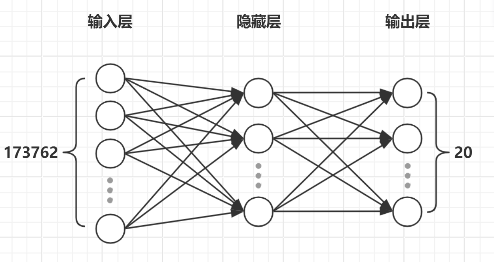
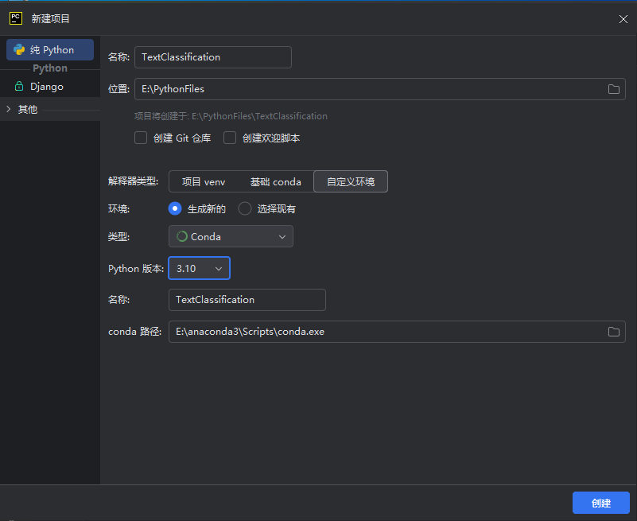
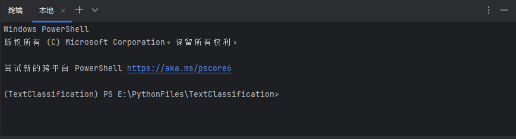
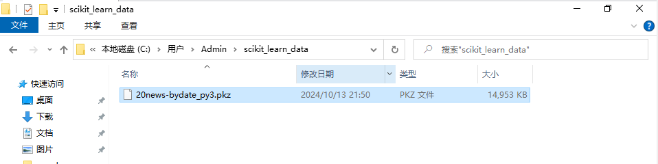
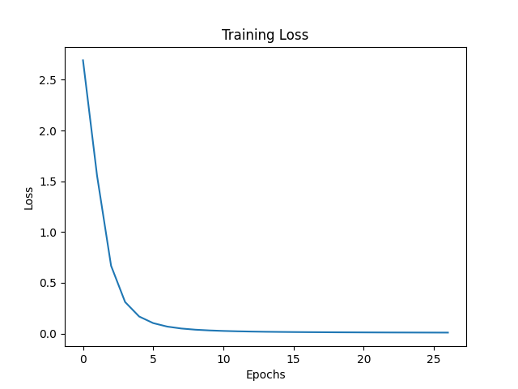

# 项目文件介绍

> README.md：项目介绍<br>
> images：README.md所使用图像<br>
> 20news-bydate_py3.pkz：sklearn下载并解析后的数据集<br>
> main.ipynb：主程序的jupyter notebook版 可分步运行观察过程<br>
> main.py：主程序<br>
> requirements.txt：项目所需的库及版本<br>
> training_loss_42_27.png：训练种子42，训练次数27的训练过程中的损失函数值变化图

# 实验一：基于神经网络的新闻文本分类

## 一、实验目的

* 熟悉文本分类的基本原理；
* 熟悉神经网络训练过程及相关参数；
* 学会评估神经网络模型的性能；
* 了解相关库的使用方法。

## 二、实验原理

### 1. 数据集介绍

fetch_20newsgroups 是一个在机器学习库 scikit-learn 中用于加载 20 个新闻组数据集的函数。这个数据集包含了大约 18000 篇新闻组文章，涵盖了20 个不同的主题，因此被称为 20 newsgroups 数据集。<br>

> 通过`from sklearn.datasets import fetch_20newsgroups`可以获取数据集。调用数据集中的属性`target_names`可以观察到20个主题名称，`data`属性获取原文信息。

### 2. 数据预处理

原文为字符串形式，需要进行预处理，将其转换为数字形式，以便于神经网络模型的训练。sklearn库中采用TF-IDF（Term Frequency-Inverse Document Frequency）算法进行文本预处理。

> TF-IDF是一种统计方法，用以评估一字词对于一个文件集或一个语料库中的其中一份文件的重要程度，其中TF是词频(Term Frequency)，IDF是逆文本频率指数(Inverse Document Frequency)。字词的重要性随着它在文件中出现的次数成正比增加，但同时会随着它在语料库中出现的频率成反比下降。TF-IDF加权的各种形式常被搜索引擎应用，作为文件与用户查询之间相关程度的度量或评级。    ——《百度百科》

$TF-IDF(t,d)=TF(t,d) * IDF(t)=\frac{n_{t,d}}{N_d} * log\frac{N}{n_t}$

其中 $n_{t,d}$ 表示词t在d文档出现次数， $N_d$ 表示文档d中所有词的出现次数总和， $N$ 是语料库中文档总数， $n_t$ 表示包含词t的文档数。

> 通过该公式可以将该数据集中所有词统计得到一个数字向量。在`sklearn`库中使用`TfidfVectorizer().fit_transform()`函数即可完成转换。通过观察得到的数据矩阵`(18846, 173762)`可以判断其包含了18000篇文章的173762个词的TF-IDF值。

### 3. 多层感知机

多层感知机（MLP，Multilayer Perceptron）是神经网络的一种类型，由至少一个隐藏层组成，每一层都有多个神经元，每个神经元都与上一层的所有神经元相连，并通过激活函数进行非线性变换，最后输出预测结果，详细内容参考课程PPT。<br>
本次实验采用最简单的网络结构，即只有一层隐藏层。根据以上对数据集的介绍，可以得到网络结构如下：



## 实验步骤

### 1. 新建项目

打开Pycharm，选择新建项目，设置Conda环境，Python版本3.10。



### 2. 安装必需库

#### 1）pip 库配置

pip是一个现代的，通用的Python管理工具。提供了对 Python 包的查找、下载、安装、卸载的功能，接下来的必需库均使用pip进行安装。由于大部分必需库均来自国外服务器，所以需要更改pip的下载源，配置方法如下。

通过`ALT+F12`或Pycharm左下角图标打开Pycharm中内嵌的终端，如下图。



随后在终端输入以下内容：`pip config set global.index-url https://pypi.tuna.tsinghua.edu.cn/simple` 完成换源，终端会输出其将设置内容写入了指定文件中。

#### 2）必需库的安装

若从github下载了该项目，~~可以直接通过在终端输入`pip install -r requirements.txt`即可完成安装~~，
否则输入以下内容：

```
pip install scikit-learn
pip install matplotlib
```
~~pip install jupyter~~

安装过程可能较为缓慢，等待完成即可。

#### 3）数据集的下载安装

由于sklearn库调用fetch_20newsgroups函数会自动下载，但其因网络原因无法下载，所以通过需要手动下载并通过sklearn解析安装。

本项目中包含了`20news-bydate_py3.pkz`为已解析后的数据集，直接将其放入`C:\Users\用户名\.scikit_learn_data`目录即可，如下图所示。



> scikit_learn_data目录在调用fetch_20newsgroups函数时会自动创建，未使用前需手动创建。

#### 4）主程序创建及运行

在Pycharm项目目录下创建main.py文件，输入以下主程序：

```
# 数据集
from sklearn.datasets import fetch_20newsgroups
from sklearn.feature_extraction.text import TfidfVectorizer
from sklearn.model_selection import train_test_split
# 神经网络模型
from sklearn.neural_network import MLPClassifier
# 模型评估
from sklearn.metrics import accuracy_score
# 保存模型
import joblib
# 数据绘制
import matplotlib.pyplot as plt
# 系统工具
import os


# 加载所有数据集
newsgroups = fetch_20newsgroups(subset='all')
# 提取特征(文本信息转换为向量特征)
vectorizer = TfidfVectorizer()  # TF-IDF特征提取器
X = vectorizer.fit_transform(newsgroups.data)
# 划分训练集和测试集
X_train, X_test, y_train, y_test = train_test_split(
    X, newsgroups.target, test_size=0.25, random_state=42)

# 加载已有模型
if os.path.exists('mlp_42_27.pkl'):
    mlp = joblib.load('mlp_42_27.pkl')
else:  # 创建分类神经网络模型
    mlp = MLPClassifier(hidden_layer_sizes=(100,),  # 隐藏层神经元数目 1层 100个
                        max_iter=100,  # 最大迭代次数
                        activation='relu',  # 激活函数 默认为relu
                        solver='adam',  # 优化算法 默认为adam
                        batch_size='auto',  # 批处理大小 默认为'auto'
                        verbose=1,  # 显示信息 10次显示一次
                        learning_rate_init=0.001,  # 学习率 默认为0.001
                        early_stopping=True,  # 是否使用早停 默认为False
                        validation_fraction=0.1,  # 验证集比例 默认为0.1 用于计算模型性能判断是否早停
                        n_iter_no_change=10,  # 早停轮数 默认为10 次数内准确率不变则停止训练
                        tol=1e-4,  # 误差最小值 默认为1e-4
                        random_state=42,)
    # 训练模型
    mlp.fit(X_train, y_train)

# 数据绘制
losses = mlp.loss_curve_
plt.plot(losses)
plt.title('Training Loss')
plt.xlabel('Epochs')
plt.ylabel('Loss')
plt.savefig('training_loss_42_27.png')
plt.show()
# 保存模型
joblib.dump(mlp, 'mlp_42_27.pkl')
# 预测测试集
y_pred = mlp.predict(X_test)
# 打印对比预测结果和实际结果
print("Predicted labels:\n", y_pred)
print("True labels:\n", y_test)
# 计算准确率
accuracy = accuracy_score(y_test, y_pred)
print("Accuracy: {:.2f}%".format(accuracy * 100))

```

即可运行程序。

通过本项目包含的main.py可以直接运行程序。

> 除此之外，main.ipynb可以在jupyter环境下逐步运行程序，便于观察运行结果，且jupyter的变量将存储在工作空间，可以直接通过Pycharm查看。（jupyter仅能在Pycharm Professional版本运行`:(`，若想使用可自行安装或通过Anaconda自带jupyter配置环境）

程序的首次运行会创建单隐藏层100神经元的神经网络模型，并训练100次（27次后停止训练），保存模型到mlp_42_27.pkl文件中，并绘制训练过程中的损失函数值变化图。该模型已训练好，由于体积较大未上传github，保存至[百度网盘](https://pan.baidu.com/s/1ce6nrPBK865Tnj6LaFi93Q?pwd=qqry)。
运行结果如图`training_loss_42_27.png`。



#### 5）模型参数调整

通过调整`MLPClassifier`中模型的参数可以得到更好的模型效果，通过自行训练观察训练过程，分析各参数的影响。

### 心得体会👇
